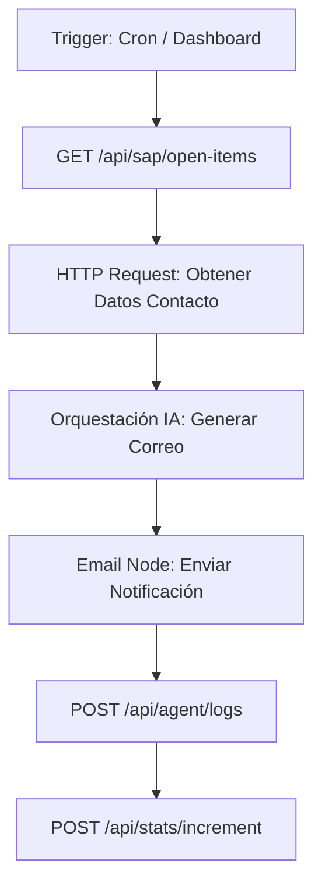

# Guía de Automatización en n8n: Agente de Cobranzas

Esta guía detalla los pasos técnicos para construir el workflow de n8n que automatiza la notificación de facturas pendientes utilizando la infraestructura de la plataforma.

## 1. Arquitectura del Flujo



## 2. Tareas y Endpoints Obligatorios

### Tarea 1: Obtención de Partidas Abiertas (Sap Mock)
- **Método**: `GET`
- **Url**: `https://dev.agentplatform.erpconsultingsap.com/api/sap/open-items`
- **Función**: Recupera todas las facturas con `AUGBL = ''` (partidas abiertas) y `BSCHL IN ('01', '11')`.

### Tarea 2: Enriquecimiento de Datos de Contacto
- **Método**: `GET`
- **Url**: `https://dev.agentplatform.erpconsultingsap.com/api/sap/customer-contact/:kunnr`
- **Función**: Por cada cliente (`KUNNR`) obtenido en la Tarea 1, n8n debe llamar a este endpoint para obtener el email y nombre del contacto.

### Tarea 3: Registro de Auditoría (Logs)
- **Método**: `POST`
- **Url**: `https://dev.agentplatform.erpconsultingsap.com/api/agent/logs`
- **Payload**:
```json
{
  "agent_name": "CollectionsNotifyAgent",
  "kunnr": "10000005",
  "action": "EMAIL_SENT",
  "status": "SUCCESS",
  "detail": "Factura 18000005 notificada a msanchez@beta-systems.es"
}
```

### Tarea 4: Incremento de Estadísticas
- **Método**: `POST`
- **Url**: `https://dev.agentplatform.erpconsultingsap.com/api/stats/increment`
- **Payload**: `{"key": "n8n_executions"}`

---

## 3. Pruebas Rápidas (Test Payload)

Para desarrollar el workflow sin afectar las tablas de SAP Mock, n8n puede consumir un payload de prueba listo para procesar:
- **Url**: `https://dev.agentplatform.erpconsultingsap.com/api/sap/test-data`
- **Contenido**: Devuelve una lista con Marta Sánchez y Carlos Gómez, incluyendo sus números de factura y correos.

## 4. Recomendación de Nodos en n8n

1.  **Airtable/DB (Opcional)**: Si se requiere persistir estados intermedios.
2.  **Code Node**: Para agrupar facturas por cliente antes de enviar un único correo por cada `KUNNR`.
3.  **Gmail/Outlook Node**: Para el envío final. Utilizar las credenciales sincronizadas desde la plataforma si se integran via API.
